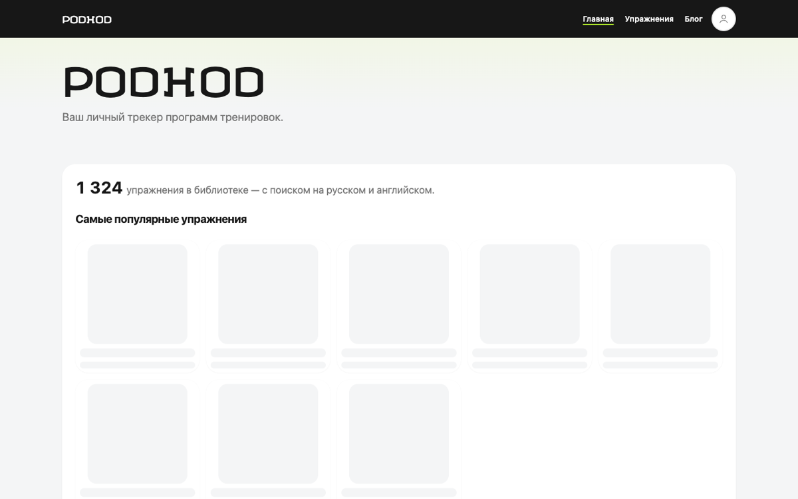
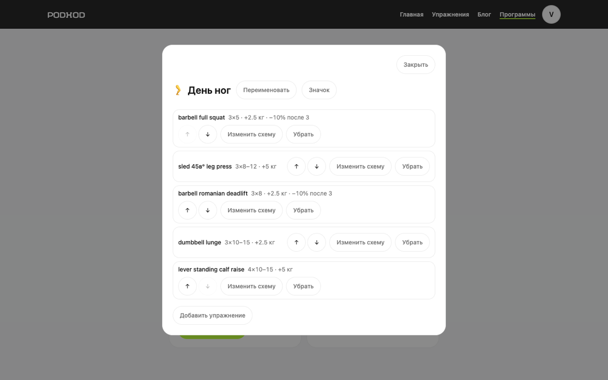
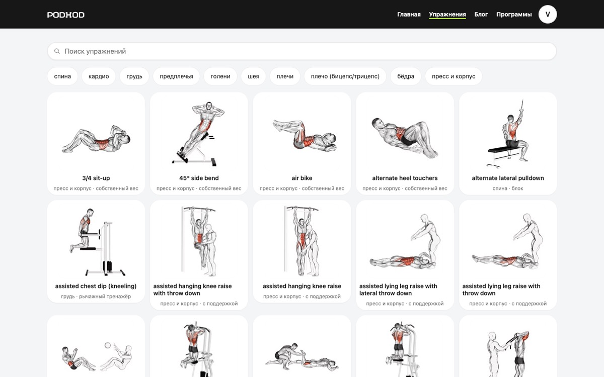
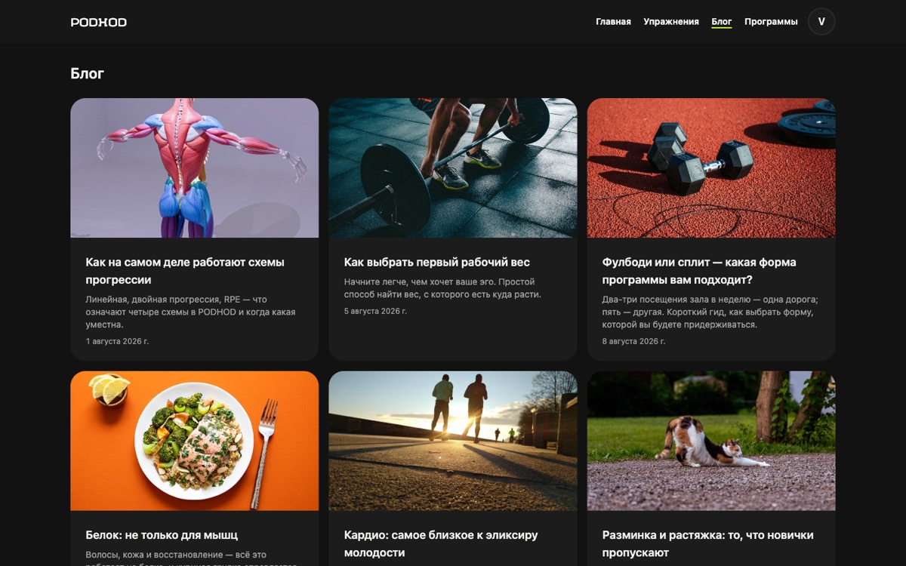

# PODHOD

Your personal workout program and tracker. A bilingual (English/Russian)
strength-training app: an exercise library of 1,324 movements with
step-by-step instructions, and a program builder where every exercise
carries its own progression rule — the app computes what to lift next from
your own history.

*Подход* is the Russian word for a set — and for "an approach."

**Live:** https://podhod-workout.cc

## Features

- **Exercise library** — 1,324 exercises, searchable in Russian and English,
  filterable by body part, each with step-by-step instructions and an
  animated demonstration
- **Programs as workouts** — a program is one training day's sheet, the way
  a coach writes one: exercises with weights. One-click create, instant
  adds with editable defaults, drag-free reordering, icons, search across
  saved and ready-made programs
- **Progression schemes** — four per-exercise rules (fixed, linear with
  deloads, double progression, RPE autoregulation) computed by a pure engine
  that also explains *why* a weight changed
- **Ready-made programs** — curated single-workout templates that copy into
  the account fully built and stay editable
- **Accounts** — email/password and Google sign-in, manual account linking,
  sessions as `HttpOnly` cookies in D1
- **Bilingual and themed** — full RU/EN interface with a language toggle,
  light/dark/auto theme, responsive from 320px up
- **Blog** — short articles on training basics, in both languages

<p align="center">
  
  
</p>
<p align="center">
  
  
</p>

## Stack

| Layer | |
|---|---|
| Client | Vite 7 · React 19 · TanStack Router · TanStack Query |
| Styling | Tailwind CSS 4 |
| Motion | GSAP 3 · Flip |
| API | Hono on Cloudflare Workers |
| Database | Cloudflare D1 (SQLite) · Drizzle ORM |
| Auth | Better Auth · Drizzle adapter · sessions in D1 |

A single Worker serves both the API and the client's static assets, so
`/api/*` is same-origin — the property that lets Better Auth use ordinary
`HttpOnly` cookies instead of a token exchange. The library is public;
everything under `/programs` requires a session, checked in the route's
`beforeLoad` and again on every API request. Design and rationale live in
[`docs/design.md`](docs/design.md).

## The progression engine

`packages/core` computes what to lift next. Given a scheme and your own
history of an exercise, `nextTarget()` returns the sets, reps and weight for
the next session — plus *why* it changed, as `progressed`, `held` or
`deloaded`, so the UI can explain a deload rather than silently dropping
your weight. Every computed weight rounds **down** to the configured plate
increment, and with no history the engine returns `needsBaseline` instead of
guessing.

It is deliberately pure: no clock, no database, no network, no randomness.
Every rule is testable with a literal input and a literal expectation, and a
test enforces the purity by reading the source — a `Date.now()` added down
an untested branch fails the build.

## Development

```bash
pnpm install
pnpm --filter @podhod/api run db:migrate:local   # create the local D1
pnpm --filter @podhod/api run seed:local         # seed the 1,324 exercises
```

Auth needs a signing secret in `apps/api/.dev.vars` (git-ignored):

```bash
echo "BETTER_AUTH_SECRET=$(openssl rand -base64 32)" >> apps/api/.dev.vars
```

Google sign-in additionally needs an OAuth client's id and secret in the
same file, with `http://localhost:8787/api/auth/callback/google` among its
authorised redirect URIs.

```bash
pnpm dev         # Worker on :8787 + Vite on :5173 — open http://localhost:5173
pnpm test        # unit tests, every package
pnpm typecheck
pnpm --filter @podhod/web run e2e   # Playwright (needs `pnpm dev` running)
```

Note the `run` in filtered commands: `pnpm --filter <pkg> <name>` silently
does nothing when `<name>` collides with a pnpm subcommand. Deploys happen
on push to `main`: GitHub Actions verifies (typecheck, unit, e2e), migrates
D1, then deploys the Worker.

## Exercise data

Built on [hasaneyldrm/exercises-dataset](https://github.com/hasaneyldrm/exercises-dataset):
1,324 exercises with body part, equipment, target muscle and instructions.
The 85-term taxonomy is hand-curated into gym Russian
(`data/taxonomy.ru.json`); exercise **names stay in English in both
locales** — a deliberate call, since 1,324 names cannot be hand-translated
the way the taxonomy was, and machine translation produces broken Russian.
The schema already stores a name per language, so Russian names can be
filled in later without a migration.

**Media attribution.** The exercise images and animations are
**© [Gym visual](https://gymvisual.com/)** and are not covered by this
repository's licence. They are used at 180×180 with attribution retained,
per the source dataset's
[NOTICE](https://github.com/hasaneyldrm/exercises-dataset/blob/main/NOTICE.md).
Anyone reusing this project needs to review Gym visual's terms and obtain
their own licence where required. The dataset's non-media content is MIT.
Blog cover photos are from [Unsplash](https://unsplash.com/), credited in
each article.

## Why there is no watch integration

Deliberate, not missing. Garmin does not expose the capability required to
write set-level data into FIT files, Apple HealthKit has no web API, and
commercial aggregators start around $399/month. Reading activity data *from*
Garmin requires application approval and, for some metrics, a licence fee.
